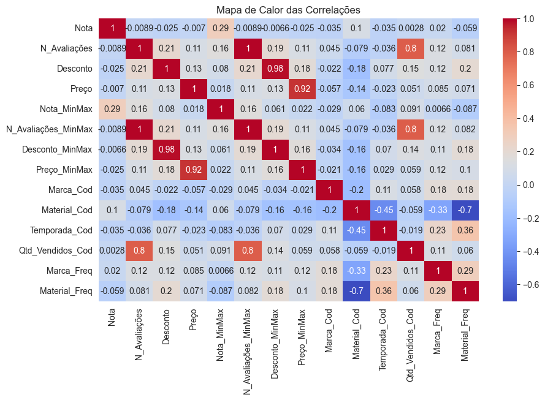

# 📊 Análise de Dados de Produtos de E-commerce

Este projeto tem como objetivo realizar uma análise exploratória e visual dos dados de produtos disponíveis em um e-commerce, com foco em gerar **insights estratégicos** para o negócio.

## 🧾 Conteúdo do Projeto

- `coleta_dados.ipynb`  
  Obtenção e organização inicial dos dados.

- `linpeza_tratamento.ipynb`  
  Tratamento de valores nulos, duplicados e formatação.

- `Analise_Exploratoria.ipynb`  
  Análises iniciais de colunas como preço, notas, avaliações e categorias.

- `visualizacao_dados.ipynb`  
  Criação de gráficos:  
  - Histograma  
  - Dispersão  
  - Mapa de Calor  
  - Barras  
  - Pizza  
  - Densidade  
  - Regressão

- `insights_estratégicos.ipynb`  
  Insights com base nos dados tratados.

- `Insights_Estratégicos_com_Base_nas_Visualizações.ipynb`  
  Complemento visual e estratégico a partir dos gráficos gerados.

## 🧼 Pré-processamento

- Exclusão de produtos com 0 avaliações  
- Padronização de valores categóricos  
- Normalização de colunas numéricas  
- Codificação de variáveis para análise

## 📌 Principais Descobertas

- Produtos como kits de roupas íntimas e maternidade têm **nota média acima de 4.8**.  
- Algumas categorias vendem muito mesmo com **notas médias por volta de 3.5**.  
- **Preço não influencia diretamente a avaliação média**, o que é relevante para estratégias de precificação.

## 🎯 Insights Estratégicos

- Aumentar estoque de produtos com maior avaliação e vendas  
- Investir em marketing para categorias com alta performance  
- Explorar nichos com potencial, mesmo que atualmente tenham avaliações medianas

## 🖼️ Exemplo de Visualização

*Gráfico de correlação entre variáveis (exemplo):*  

## 🛠️ Tecnologias Utilizadas

- Python  
- Pandas, NumPy  
- Seaborn, Matplotlib  
- Jupyter Notebook

---

## 📂 Como Executar

1. Clone este repositório  
2. Instale os pacotes necessários com `pip install -r requirements.txt`  
3. Execute os notebooks com Jupyter

---

## 📬 Contato

Projeto desenvolvido por **Erick Pinto Viana**  
📧 Email: erickvianapinto00@gmail.com  
🔗 [LinkedIn](https://linkedin.com/in/erick-viana-001372266) | [GitHub](https://github.com/Erick-Viana)

---

## 🚀 Próximos Passos

- 📈 Modelos preditivos para vendas  
- 📊 Dashboards com Streamlit ou Power BI  
- 🤖 Clusterização de produtos  
- 💬 Análise de sentimentos de avaliações (se disponível)  
- 🔁 Automação para ingestão contínua de dados  

